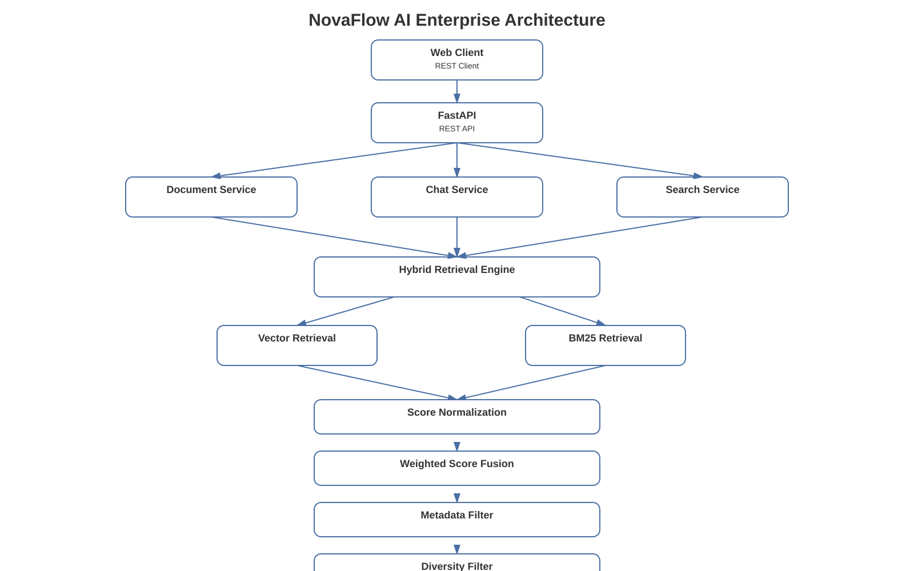
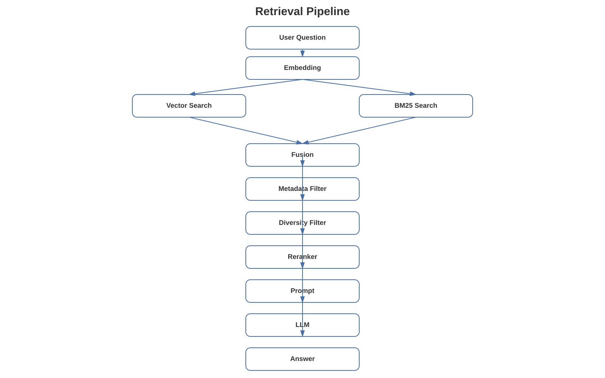
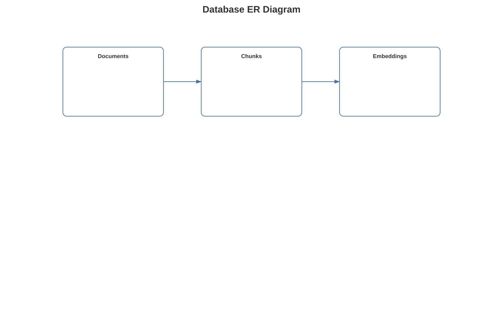
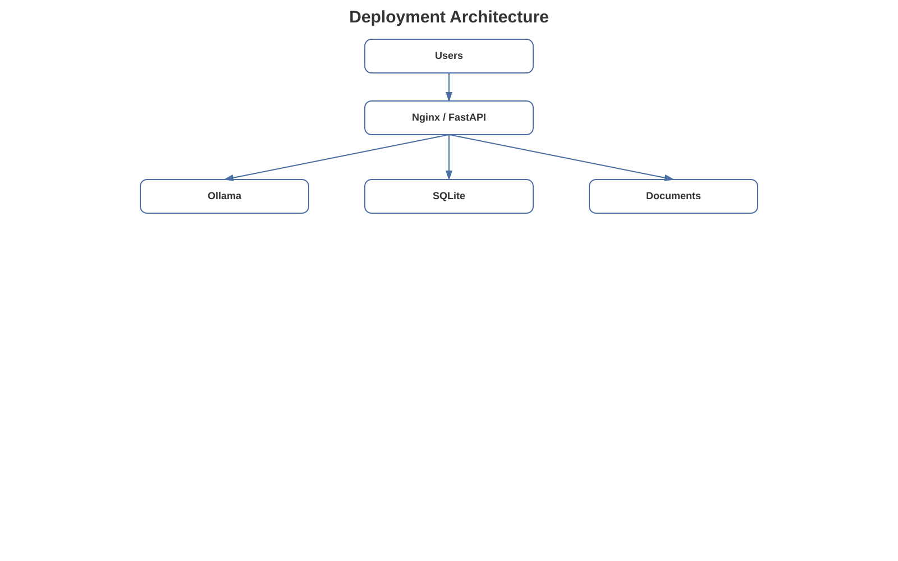
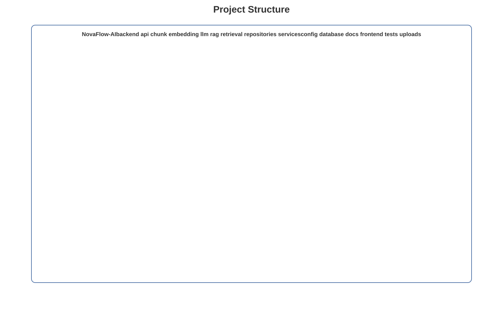

# 🚀 NovaFlow AI

> **Enterprise AI Knowledge Platform powered by Retrieval-Augmented Generation (RAG), Hybrid Retrieval, Semantic Chunking and Local Large Language Models.**


NovaFlow AI is an enterprise-oriented AI platform designed for intelligent document management, knowledge retrieval, AI-powered question answering, and enterprise knowledge assistants.

Unlike traditional chatbot demos, NovaFlow AI focuses on production-oriented Retrieval-Augmented Generation (RAG) architecture with modular design, explainable retrieval, hybrid search, semantic chunking, reranking, and local Large Language Model deployment.

---

# Current Version

**Version 0.5.0**

Enterprise Retrieval-Augmented Generation Platform

---

# Table of Contents

1. [Project Overview](#project-overview)
2. [Key Features](#key-features)
3. [System Architecture](#system-architecture)
4. [Technology Stack](#technology-stack)
5. [Project Structure](#project-structure)
6. [Core Modules](#core-modules)
7. [Retrieval Pipeline](#retrieval-pipeline)
8. [Database Design](#database-design)
9. [Quick Start](#quick-start)
10. [REST API](#rest-api)
11. [Testing](#testing)
12. [Performance](#performance)
13. [Screenshots](#screenshots)
14. [Roadmap](#roadmap)
15. [Project Highlights](#project-highlights)
16. [Documentation](#documentation)
17. [License](#license)
18. [Contact](#contact)

---

# Project Overview

NovaFlow AI is a modular enterprise Retrieval-Augmented Generation platform designed for intelligent knowledge management.

The platform combines:

- Dense semantic retrieval
- Sparse lexical retrieval
- Hybrid retrieval
- Score normalization
- Weighted score fusion
- Metadata filtering
- Diversity filtering
- Dynamic Top-K selection
- CrossEncoder reranking
- Context cleaning
- Context deduplication
- Source attribution
- Local Large Language Models

The goal is to provide accurate, explainable, privacy-friendly AI assistants for enterprise knowledge scenarios.

NovaFlow AI is designed as a foundation for:

- Enterprise knowledge bases
- AI copilots
- Intelligent document search
- Internal knowledge assistants
- Customer support systems
- Document intelligence applications
- Future AI workflow automation

The architecture emphasizes:

- Enterprise scalability
- High maintainability
- Modular design
- Explainable retrieval
- Production-oriented engineering
- Local-first AI deployment

---

# Key Features

| Feature | Status |
|----------|--------|
| Document Upload | ✅ |
| Document Parsing | ✅ |
| Checksum Validation | ✅ |
| Smart Chunking | ✅ |
| Semantic Chunking | ✅ |
| Chunk Overlap | ✅ |
| Semantic Embedding | ✅ |
| Vector Retrieval | ✅ |
| BM25 Retrieval | ✅ |
| Hybrid Retrieval | ✅ |
| Score Normalization | ✅ |
| Weighted Score Fusion | ✅ |
| Metadata Filtering | ✅ |
| Diversity Retrieval | ✅ |
| Dynamic Top-K | ✅ |
| CrossEncoder Reranking | ✅ |
| Context Cleaning | ✅ |
| Context Deduplication | ✅ |
| Source Attribution | ✅ |
| Local LLM Integration | ✅ |
| REST API | ✅ |
| Automated Testing | ✅ |
| Docker | 🚧 |
| PostgreSQL | 🚧 |
| Redis Cache | 🚧 |
| Milvus / FAISS | 🚧 |
| Multi-user Support | 🚧 |
| Authentication / RBAC | 🚧 |

---

# System Architecture

NovaFlow AI follows a modular enterprise-oriented architecture separating document management, intelligent processing, retrieval, RAG orchestration, and local LLM inference.

## Enterprise System Architecture



The architecture is designed around clear separation of responsibilities and low coupling between major components.

---

## Retrieval Architecture



The retrieval layer combines semantic vector search and BM25 lexical retrieval before applying score normalization, hybrid score fusion, metadata filtering, diversity filtering, dynamic Top-K selection, and CrossEncoder reranking.

---

## Database Architecture



The database layer manages documents, document content, chunks, embeddings, and associated metadata.

---

## Deployment Architecture



The deployment architecture supports the current local development environment while providing a foundation for future Docker, PostgreSQL, Redis, Kubernetes, and cloud-native deployment.

---

## Project Structure Architecture



The project follows a modular backend structure separating API endpoints, services, retrieval, RAG, embedding, LLM, repositories, and utility components.

---

# Technology Stack

| Layer | Technology |
|---------|------------|
| Programming Language | Python 3.12 |
| Backend Framework | FastAPI |
| Database | SQLite |
| ORM | SQLAlchemy |
| Embedding Model | BAAI/bge-small-en-v1.5 |
| Vector Search | Cosine Similarity |
| Sparse Retrieval | BM25 |
| Hybrid Retrieval | Weighted Score Fusion |
| Reranker | BAAI/bge-reranker-base |
| Local LLM | Ollama + Llama3.2 |
| API | RESTful API |
| Testing | Pytest |
| Version Control | Git |
| Documentation | Markdown |
| Future Database | PostgreSQL |
| Future Vector Database | Milvus / FAISS |
| Future Cache | Redis |
| Future Deployment | Docker / Kubernetes |

---

# Engineering Principles

NovaFlow AI follows several software engineering principles.

### High Cohesion

Each module focuses on a clearly defined responsibility.

### Low Coupling

Core services are designed to communicate through clear interfaces.

### Modular Architecture

Document processing, retrieval, RAG, LLM, API, and persistence layers are separated into independent modules.

### Explainable AI

The retrieval pipeline supports source attribution so that generated answers can be connected to retrieved knowledge.

### Local-first AI

Local LLM inference through Ollama enables sensitive enterprise knowledge to remain within the local environment.

### Production-oriented Design

The project structure is designed with future scalability, testing, deployment, and maintainability in mind.

---

# Project Structure

```text
NovaFlow-AI
│
├── backend/
│   ├── api/
│   ├── chunk/
│   ├── core/
│   ├── embedding/
│   ├── llm/
│   ├── parser/
│   ├── rag/
│   ├── repositories/
│   ├── retrieval/
│   ├── services/
│   └── utils/
│
├── config/
│
├── database/
│
├── docs/
│   ├── architecture/
│   ├── diagrams/
│   ├── images/
│   ├── screenshots/
│   └── user-guide/
│
├── frontend/
│
├── portfolio/
│
├── prompts/
│
├── tests/
│   ├── data/
│   └── ...
│
├── .gitignore
├── CHANGELOG.md
├── CONTRIBUTING.md
├── LICENSE
├── README.md
├── ROADMAP.md
└── requirements.txt